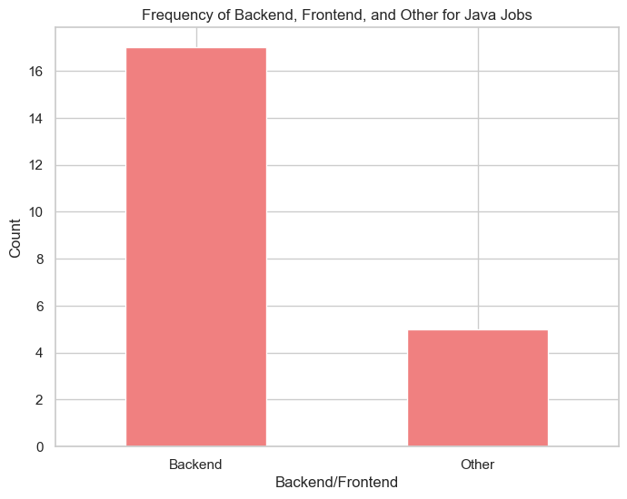
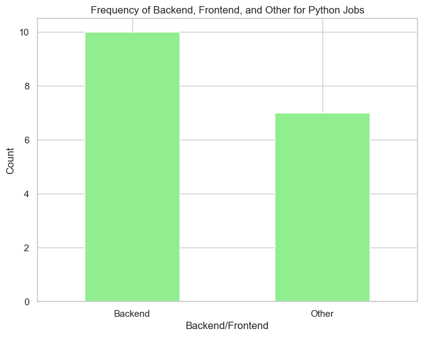
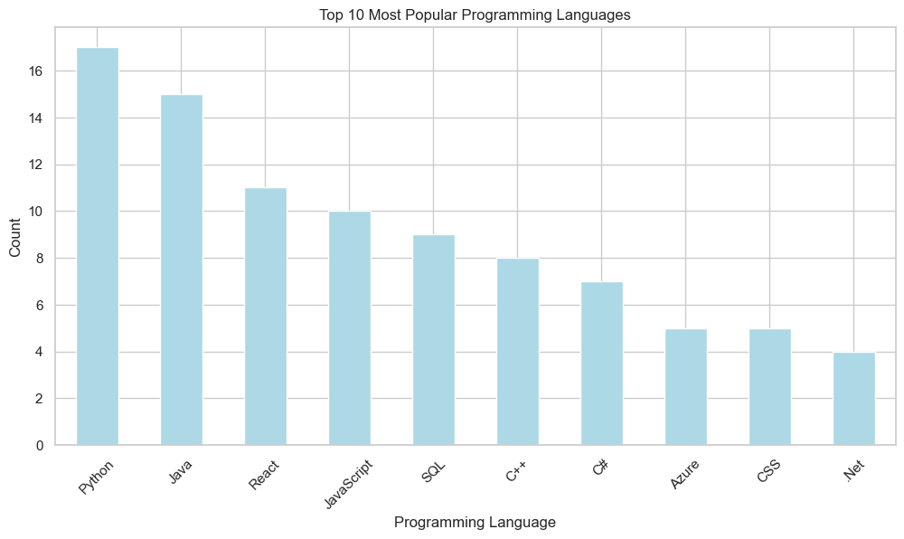
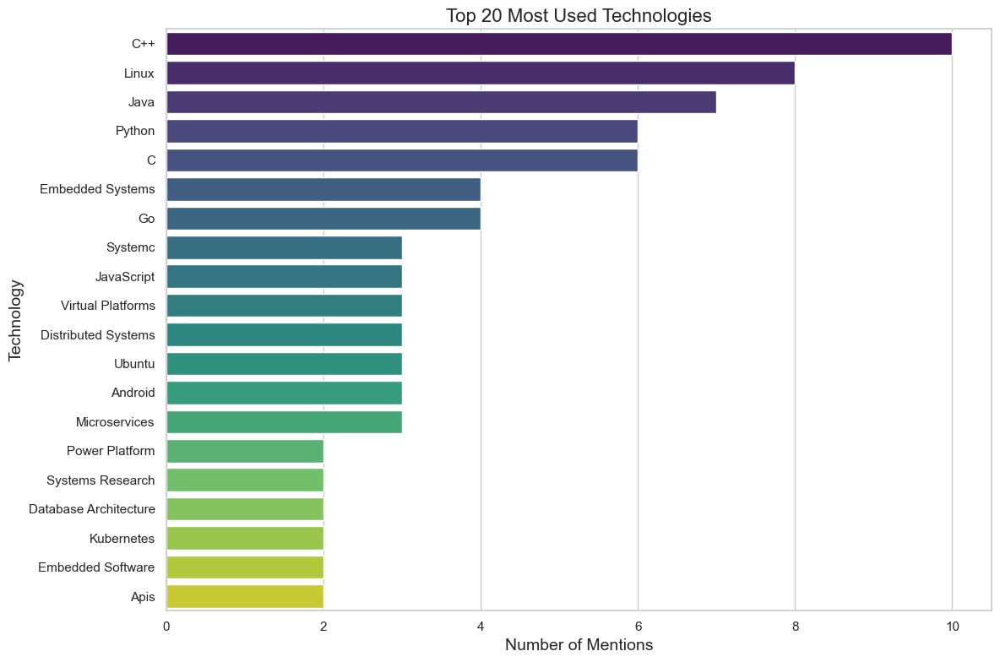
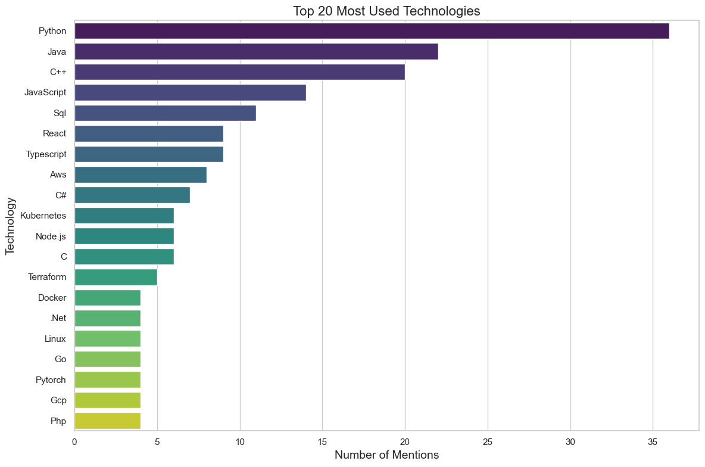

# Job Technology Analysis

An analysis of the most used technologies in job postings.

## Files and Structure

- **`data/`**: Contains the original data file, `jobs_edinburgh.csv`,`jobs_london.csv`, `jobs_london_new.csv`.
- **`images/`**: Contains generated visuals, like `edinburgh.png`, `london.png`, and visuals from the new analysis (`java.png`, `python.png`, `popular-london.png`).
- **`code/`**, Contains Jupyter Notebooks used for analysis: `analysis_london.ipynb`, `analysis-london-new.ipynb`.

## New Analysis

## Edinburgh

## London 

