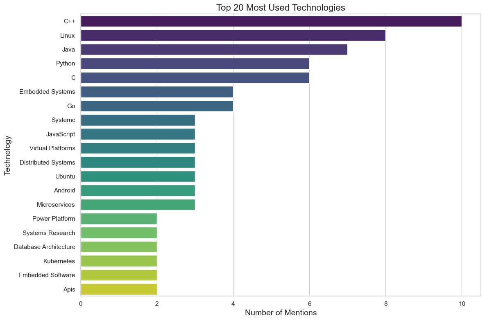

# Job Technology Analysis

An analysis of the most used technologies in job postings, based on data collected from various companies within a 40 km radius of Edinburgh, sourced from LinkedIn.

## Files and Structure

- **`data/`**: Contains the original data file, `jobs.csv`.
- **`images/`**: Contains generated visuals, like `top_technologies.png`.
- **`analysis.ipynb`**: The Jupyter Notebook with code and analysis steps.

